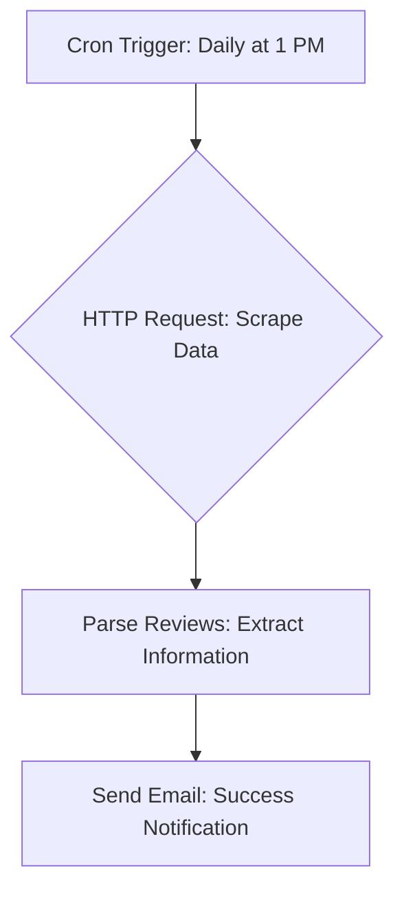

# Trustpilot Review Scraper Automation using n8n

## Project Description

This project is a web scraping automation built with n8n. The workflow automatically extracts new reviews from a specified company on Trustpilot, runs on a daily schedule, and sends an email notification upon successful completion. This demonstrates fundamental skills in workflow automation, data extraction, and scheduled execution.

##  deliverables

### 1. Workflow Diagram

The following diagram illustrates the complete automation flow from the trigger to the final notification.

### 2. n8n Workflow File (.json)

The complete n8n workflow is available in this repository. You can download the JSON file and import it into your own n8n instance to run this automation.

### 3. Loom Video Demonstration

A short video (under 5 minutes) demonstrating the live automation. The video shows the n8n workflow, a manual execution, successful data extraction, and the final email notification being received.

## Features

- **Scheduled Execution:** The workflow is configured to run automatically every day at 1:00 PM.
- **Data Extraction:** Scrapes review data from a target company on Trustpilot.
- **Email Notification:** Sends a confirmation email to a specified address after each successful run.

## Tools Used

- **Automation:** n8n
- **Data Source:** Trustpilot
- **Diagramming:** Mermaid
- **Demonstration:** Loom
